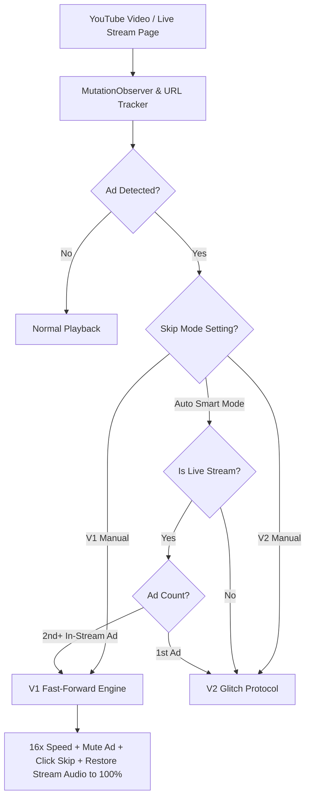

# 🚀 Glitch Ad Skipper

**Glitch Ad Skipper** is an advanced Manifest V3 Chrome Extension built for YouTube ad bypass, featuring **Auto Smart Mode** and specialized support for **Live Stream Side-by-Side (Split-Screen / Double-Box) Mid-Roll Ads**.

It combines protocol-based ad skipping (V2) with a 16x fast-forward engine (V1) and automatic live stream audio restoration to provide a seamless viewing experience without buffering or stream interruptions.

---

## ✨ Features

- **🤖 Auto Smart Mode (Recommended)**  
  Intelligently detects whether you are watching a regular YouTube video or a Live Stream and automatically selects the optimal skip method.
- **⚡ V2: Glitch Protocol Trigger**  
  Uses a custom Windows URI protocol handler (`glitchskip://`) to break out of pre-roll ad playback instantly.
- **⏩ V1: 16x Fast-Forward Engine**  
  Mutes ad videos, sets playback rate to 16x, seeks to the tail end of the ad, and auto-clicks native YouTube skip buttons across all layout variants (`.ytp-ad-skip-button-modern`, `.ytp-skip-ad-button`, `.ytp-ad-skip-button-slot`, etc.).
- **🔊 Live Stream Audio Restoration**  
  When YouTube displays in-stream side-by-side mid-roll ads (where stream audio is ducked or muted), the extension automatically restores the main live broadcast audio back to **100% volume (`1.0`, unmuted)** while fast-forwarding the ad on the right.
- **🥷 Stealth & Anti-Fingerprinting**  
  Uses dynamic, randomized DOM attribute names (`data-gs-XXXXXX`) per page load, humanized reaction delays (80ms–520ms), and throttled observers to remain invisible to static scripts and detectors.

---

## 🛠️ How It Works

### Auto Smart Mode Logic

| Content Type | Ad Type / Occurrence | Selected Engine | Execution Strategy |
| :--- | :--- | :--- | :--- |
| **Normal Video** | Any Ad | **V2: Glitch Protocol** | Triggers protocol handler to bypass pre-roll/mid-roll immediately. |
| **Live Stream** | 1st Ad (Pre-roll) | **V2: Glitch Protocol** | Instant protocol trigger before stream begins. |
| **Live Stream** | 2nd+ Ad (Side-by-Side / In-Stream Mid-roll) | **V1: 16x Fast-Forward** | Mutes ad video, speeds to 16x, clicks skip button, and **restores live stream audio to 100%**. |



---

## 📦 Installation & Setup

### Step 1: Register Protocol Handler (For V2 Glitch Mode)
1. Navigate to the project folder on your computer.
2. Double-click **`install_protocol.bat`**.
3. This adds `glitchskip://` to your Windows Registry (`HKCU\Software\Classes\glitchskip`), linking it to `fake.bat` (a safe script that exits instantly).

> [!NOTE]
> Admin privileges are **not required** because registry entries are saved under `HKCU`.

### Step 2: Load Extension in Google Chrome
1. Open Google Chrome and go to `chrome://extensions`.
2. Enable **Developer mode** in the top right corner.
3. Click **Load unpacked** in the top left.
4. Select the `Glitch Ad Skipper` root directory.

---

## ⚙️ Configuration & Popup UI

Click the **Glitch Ad Skipper** icon in the Chrome toolbar to open the settings popup:

- **Auto Smart Mode** (Default / Recommended): Automatically switches between V2 (pre-rolls) and V1 (live stream mid-rolls).
- **V1: Fast-forward**: Forces V1 16x fast-forward mode for all videos.
- **V2: Glitch Protocol**: Forces V2 protocol trigger for all videos.

Settings are saved automatically to `chrome.storage.local`.

---

## 📁 Repository Structure

```
Glitch Ad Skipper/
├── manifest.json         # Extension Manifest V3 configuration
├── content.js            # Core stealth content script & skip engines
├── content.css           # Styling for injected stealth skip button
├── popup.html            # Extension popup user interface
├── popup.js              # Popup setting controller & storage sync
├── popup.css             # Styling for extension popup UI
├── install_protocol.bat  # Windows Registry protocol handler setup script
├── fake.bat              # Protocol target script (safe, instant exit)
└── AD in stream.md       # Technical document on In-Stream & SxS ad architecture
```

---

## 📄 License

This project is open-source and intended for educational and personal customization purposes.
